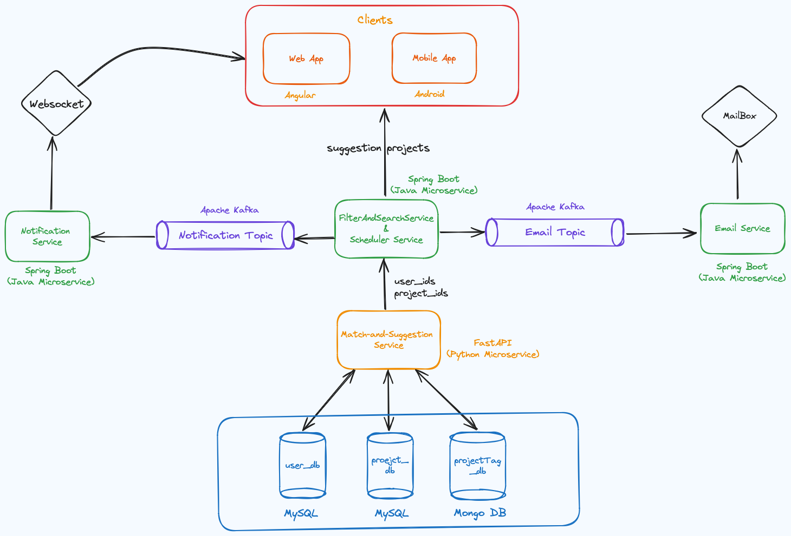
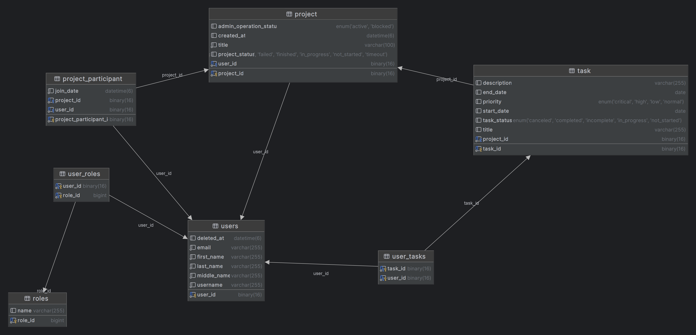

# Call-Of-Project Backend

<p float="left">


</p>

### Author
- **Author:** [Nuri Can ÖZTÜRK](https://github.com/nuricanozturk01)

# Contents
- [Javadoc Documentation](#documentation)
- [Overview](#overview)
- [Architecture](#architecture)
- [Used Technologies](#used-technologies-frameworks-environments)
- [Services](#services)
  - [Detailed Descriptions](#detailed-descriptions)
- [Other parts](#other-parts)
- [Architecture Diagram](#architecture-diagram)
- [ER Diagrams](#er-diagrams)
- [Test Results](#test-results)
- [Project Load Test Results](#project-load-test-results)
- [Installation](#setup)

## Javadoc Documentation
- [Javadoc for some services](https://callofproject.github.io/Call-of-Project-API-Documentation/)

## Overview
Call-Of-Project is an application where people can find project partners, collaborate on projects together, and manage project management to some extent. With this application, individuals can find friends to progress together when they have a project in mind, and people who want to join a project can also become part of a project. The project owner can create a project, approve joining requests for the project, and assign tasks to team members within the same project. Additionally, the project owner can prepare coding or testing interviews to select the right people to join the project. This way, they can work on a project together.

## Architecture
Call-Of-Project follows a **microservices-based architecture**. Our application has adopted microservices architecture and uses **Apache Kafka** to ensure data integrity, collect and process data, and ensure the smooth operation of various processes. In this context, communication is established between microservices and data transfer is carried out using **Kafka's message queue** feature. Furthermore, with the features provided by Kafka such as clustering and high availability, the system's durability and performance are enhanced. Thus, while data flow is provided throughout the application, data integrity and proper processing of transactions are ensured. Users send all requests through a single endpoint via **API Gateway**. Each microservice has its own database. User authentication and authorization operations are performed using **JWT**. Sensitive information such as passwords is stored in hashed form. Actions in our application are sent to the necessary users via notification and/or email. We used **Apache Kafka** and **Websocket** for notifications to be delivered in real-time. Additionally, there are **scheduler services** in our application that run at specific times every day. These services are responsible for sending reminder emails to users, handling applications with past feedback time, and closing projects with expired deadlines, among other purposes.

### Used Technologies
- Java 17
- Spring Boot 3.1.5
- Apache Kafka
- Websocket
- JWT
- MySQL
- MongoDB
- H2 for tests
- Eureka Server
- API Gateway
- Our Team Libraries
- JUnit
- Mock
- Mapstruct
- Amazon S3 (for file and photos)
- Pagination
- ...

## Services

Our application consists of **11** services:

1. **Authentication Service**
2. **Project Service**
3. **Interview Service**
4. **Community Service**
5. **Task Service**
6. **Ticket Service**
7. **Notification Service**
8. **Scheduler Service**
9. **Email Service**
10. **Environment Service**
11. **Filter and Search Service**

These services are independent and can operate as standalone applications, adhering to the principles of microservices architecture. Additionally, we used **EurekaServer** to facilitate the discovery of services. We aimed to make our application scalable and adaptable to growth as much as possible. We also adhered to **SOLID principles** as much as possible while developing services.

### Detailed Descriptions

- **Authentication Service**: Responsible for user information, authentication, and user profile-related operations. Communicates with the **Environment service** to obtain necessary information. Also, it publishes user information that is saved, deleted, or updated to the required topic.
- **Project Service**: Manages operations related to projects, such as creating and updating projects. It also contains special methods for the user, admin, and root roles.
- **Interview Service**: Manages the preparation of interviews by project owners and allows participant candidates to attend interviews. With this service, you can prepare Coding and Test interviews. You can participate in the interview via the link sent to you by email. In the Coding interview, you will be greeted with an IDE where you can run and test your code.
    - **Frontend**: [CallOfProject/Call-Of-Project-Interview](https://github.com/CallOfProject/Call-Of-Project-Interview)
- **Community Service**: A service where users can connect with each other. Perhaps a chat system could be added later.
- **Task Service**: Allows project owners to assign tasks to participants and enables participants to track their tasks. The **Scheduler service** comes into play for actions such as upcoming tasks and canceled tasks.
- **Ticket Service**: A service where users can report inappropriate incidents on the platform or report errors in the application.
- **Notification Service**: Notification messages sent to users are received by the Notification Service via **Apache Kafka**, which then sends notifications to users via **Websocket**.
- **Scheduler Service**: Triggers scheduled events. It updates the status of overdue interviews, projects, or projects whose start time has arrived.
- **Email Service**: Responsible for sending emails asynchronously.
- **Environment Service**: A service where information such as school, course, and experience of users is processed. It is dependent on a NoSQL database.
- **Filter and Search Service**: A service that performs search and filtering operations for users.

### Other parts
For more information about the project, visit our repositories:
- **Android:** [Call-of-Project-Android](https://github.com/CallOfProject/Call-Of-Project-Android)
- **Interview:** [Call-of-Project-Interview](https://github.com/CallOfProject/Call-Of-Project-Interview)
- **Admin Panel:** [Call-of-Project-Admin-Panel](https://github.com/CallOfProject/CallOfProject-AdminPanel)
- **User Matching and Project Recommendation:** [Call-of-Project-Matching-and-Recommendation](https://github.com/CallOfProject/UserMatching-Suggestion)
- **Frontend:** Not completed yet

### Architecture Diagram
- 
**General Application Diagram**
- 

 **Recommendation and Matching Service Diagram**
- 
**Deployment Diagram**
- 

### ER Diagrams
- **Authentication DB**
  - 
- **Communtiy DB**
  - 
- **Interview DB**
  - 
- **Project DB**
  - 
- **Task DB**
  - 

## Unit Test Results
https://github.com/nuricanozturk01/CallOfProject-Backend/assets/62218588/81147ddf-f037-4103-a9fb-229caac67303
  - **Test Result:** Passed all tests
    
## Project Load Test Results
This document summarizes the results of the load test conducted to assess the performance of our project.

### Test Details
- **Test Date**: May 13, 2024
- **Total Sessions**: 3994
- **Test Duration**: 7 minutes 13 seconds
- **Maximum Users**: 100

### Performance Metrics
- **Average Response Time**: 0.4466 seconds
- **90% Response Time**: 0.4889 seconds
- **Maximum Response Time**: 0.794 seconds

### Results
The test results demonstrate that our system is high-performing and stable. With 100 users, we are able to maintain low response times, proving our commitment to optimizing user experience.

These results provide a solid foundation for future scalability efforts. We aim to scale our system to support an increasing number of users in the future.
- **References**
  - [user-dotcom-monitor](https://user.dotcom-monitor.com/) Load Testing application. (FREE VERSION) (max: 100 USER)
  
## Installation
  ### Prerequisites:
  - Maven
  - Docker
  - MySQL
  - Amazon S3
  
  Make sure to create each required database in MySQL using the following command like:
  ```sql
  create database cop_authentication_db;
  ```
  ### Setup
  Follow these steps to set up the project:
  - **1-Build the project:**
    - Navigate to the Project directory and run the following script:
    - ```bash
      bash build.sh <directory>
      ```
    - Replace <directory> with your desired path, for example:
    - ```bash
      bash build.sh ~/Desktop
      ```
    - **Notes**
      - This script creates a *call-of-project* directory in your specified directory.
      - The build script installs the necessary repositories.
  - **2- Run the project:**
    - **On Windows:**
      - ```ps
         .\win_run.ps1 <directory>\call-of-project
        ```
      - Replace <directory> with your path, for example:
      -  ```ps
         .\win_run.ps1 C:\Users\Nuri\Desktop\call-of-project\
         ```
  - **On macOS or Linux:**
      - ```bash
          bash run.sh <directory>/call-of-project
        ```
    - Replace <directory> with your path, for example:
      - ```bash
        bash run.sh ~/Desktop/call-of-project
        ```
 ### Kill Processes:
  - In macOs or Linux:
  ```bash
    bash kill_all.sh
  ```
  ### Test:
  - In project directory:
  ```bash
    bash run_tests.sh
  ```
